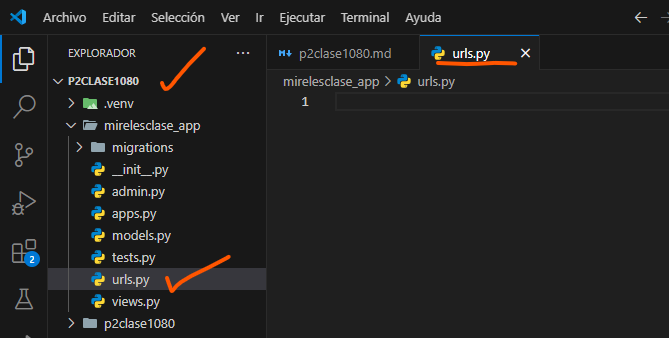
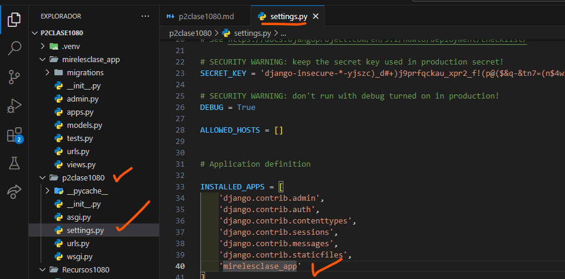
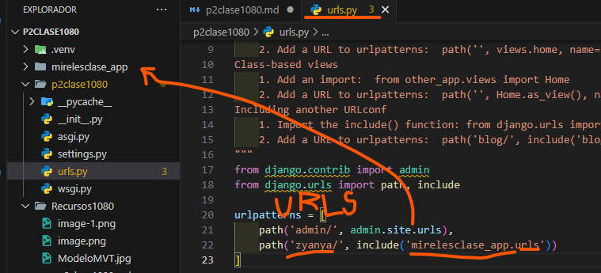
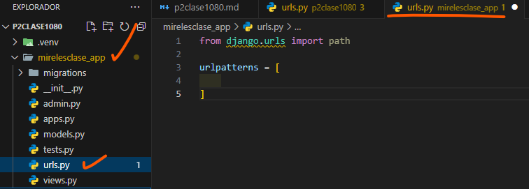
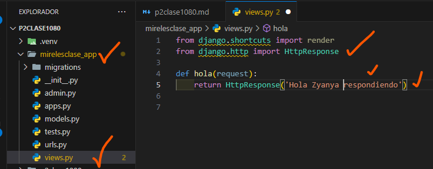
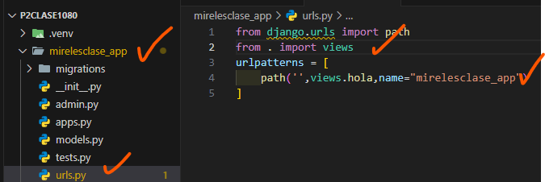

- Crear aplicación mirelesclase_app
- comando --> python manage.py startapp mirelesclase_app
- Creamos el archivo urls.py en mirelesclase_app
- 
- En setting.py de p2clase1080 
- 
- En urls.py de p2clase1080 
- 
- En urls.py en mirelesclase_app
- 
- En views.py en mirelesclase_app
- 
- En urls.py en mirelesclase_app
- 